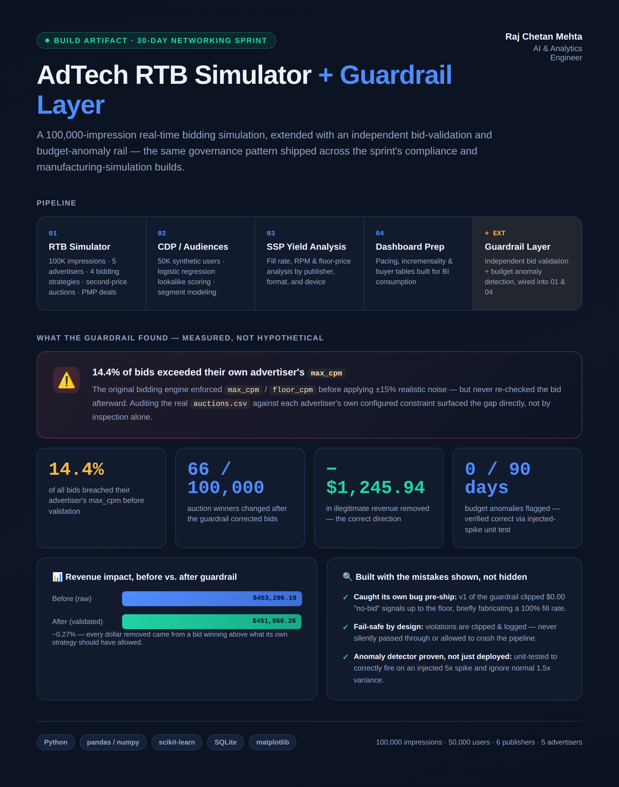

# AdTech RTB Simulator + Guardrail Layer

A 100,000-impression real-time bidding (RTB) simulation covering the full programmatic pipeline — DSP bidding strategies, a CDP with ML-based lookalike scoring, SSP yield analysis, and BI-ready dashboard prep — extended with an independent bid-validation and budget-anomaly guardrail layer.

**[View the interactive dashboard →](https://rajmehta28.github.io/adtech-rtb-simulator/)**

[](https://rajmehta28.github.io/adtech-rtb-simulator/)

## What this is

Four pipeline components simulating a real programmatic advertising stack, plus a fifth component (`guardrails.py`) that independently re-checks the pipeline's own output against its own stated rules:

| # | Component | What it does |
|---|---|---|
| 1 | `src/component1_rtb_simulator.py` | 100K impressions across 6 publishers, 5 advertisers, 4 bidding strategies, second-price auctions, PMP deals |
| 2 | `src/component2_cdp_audiences.py` | 50K synthetic user profiles, logistic-regression lookalike scoring |
| 3 | `src/component3_ssp_yield.py` | Fill rate, RPM, and floor-price analysis by publisher/format/device |
| 4 | `src/component4_dashboard_prep.py` | Pacing, incrementality, and buyer tables prepared for BI consumption |
| + | `src/guardrails.py` | Independent bid validation + budget-pacing anomaly detection, wired into components 1 & 4 |

Full write-up of the guardrail extension — what it found, how it was built, and an honest bug caught before shipping — is in [`GUARDRAIL_EXTENSION.md`](GUARDRAIL_EXTENSION.md).

## The headline finding

Auditing the simulator's own bidding engine against each advertiser's configured `max_cpm` / `floor_cpm` surfaced a real validation gap:

- **14.4%** of all bids exceeded their own advertiser's `max_cpm`
- **66 of 100,000** auction winners changed once bids were corrected
- **−$1,245.94** in illegitimate revenue removed (the correct direction — every dollar removed came from a bid that shouldn't have won)
- **0** budget-pacing anomalies flagged across 90 days, verified correct via a unit test that injects a 5x spend spike and confirms the detector fires

## Running it locally

```bash
pip install -r requirements.txt

# from the repo root — each step reads/writes data/ relative to cwd
python src/component1_rtb_simulator.py     # generates data/auctions.csv + guardrail_audit_log.csv
python src/component2_cdp_audiences.py     # generates data/users.csv, users_scored.csv
python src/component3_ssp_yield.py         # generates yield analysis + ssp_yield_analysis.png
python src/component4_dashboard_prep.py    # generates dashboard_*.csv with budget-anomaly flags
```

The large generated files (`auctions.csv`, `guardrail_audit_log.csv`, `users.csv`, `users_scored.csv`, `segments.csv`, `adtech.db`) are gitignored — they're multi-MB simulation output, not source. The small aggregate tables the dashboard reads from (`buyer_analysis.csv`, `segment_analysis.csv`, `floor_price_analysis.csv`, etc.) are committed as-is so the repo is useful without a full re-run.

## The dashboard

`docs/index.html` is a single self-contained, no-build-step HTML page (Chart.js via CDN) built directly from this project's own output data — every chart and KPI reflects the actual simulation run, not placeholder numbers.

If the dashboard link above 404s, GitHub Pages just isn't turned on yet for this repo: **Settings → Pages → Source: Deploy from a branch → Branch: main, Folder: /docs → Save**. It goes live within a minute or two.

## Stack

Python · pandas · numpy · scikit-learn · SQLite · matplotlib · Chart.js
